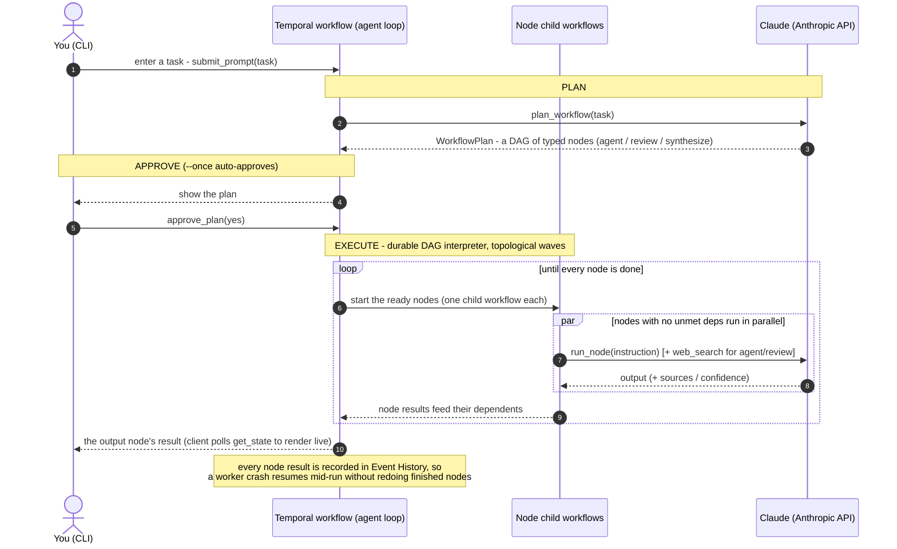

# Durable Claude Workflows

**A durable, scalable take on Claude Code's "dynamic workflows" - built on Temporal.**

Claude Code can run a multi-agent **dynamic workflow**: it writes a plan, fans the work out across
subagents, has them cross-check each other, and returns a verified result. It has two limits, both
[from the docs](https://code.claude.com/docs/en/workflows):

- **It isn't crash-proof.** *"If you exit Claude Code while a workflow is running, the next session
  starts the workflow fresh."* The run lives inside the process - kill it and everything in flight,
  plus everything already finished, is gone.
- **It's capped to one machine.** A run is limited to **16 concurrent agents** (1,000 total) "to
  bound local resource use."

This sample keeps the good part - **Claude plans the work** - and moves the *execution* onto Temporal:

- **Durable.** The run's state lives on the Temporal server, not in a process. Crash a worker,
  deploy, or reboot, and the run continues exactly where it left off - finished steps are never redone.
- **Scalable.** Each step runs as its own job across your workers. No 16-agent cap - add workers
  and the fan-out spreads across more machines.

> **Claude plans the DAG, Temporal executes it.** For *any* task, Claude returns a plan as a directed
> graph of typed steps - `agent` (a worker), `review` (adversarial cross-check), `synthesize` (the final
> answer) - wired by dependencies. You approve the plan (y/N), then a durable Temporal workflow runs it:
> every node becomes its own child workflow that calls Claude, independent nodes run in parallel, and
> every result is recorded so a crash resumes mid-run.

| | Claude Code dynamic workflows | This sample (Temporal) |
|---|---|---|
| **Crash recovery** | none - the run dies with the session | continues from the server after a crash, deploy, or reboot |
| **Fan-out limit** | 16 concurrent agents, 1,000 per run, one machine | no fixed cap - scales across a worker fleet |
| **Who plans / who runs** | the model does both, in-session | the model **plans**; Temporal **runs** it durably |
| **Visibility** | disappears when the session ends | every step is a durable, inspectable event in the Temporal Web UI |

The split is what makes it work: the model drives the *plan* (recorded once, on the server);
developer-written, repeatable code drives the *execution*. See the
[Temporal blog](https://temporal.io/blog/of-course-you-can-build-dynamic-ai-agents-with-temporal).

---

## How it works

Press enter in the chat client and it starts one durable Temporal workflow - the agent loop for that
chat. Each task runs three stages:

1. **Plan** - ask Claude to design the workflow as a DAG of typed nodes - `agent` (a worker),
   `review` (adversarial cross-check), `synthesize` (final answer) - wired by dependencies.
   *(This is the dynamic workflow Claude authors - as data, not code.)*
2. **Approve** - the plan is shown to you and you approve it (y/N), mirroring Claude Code's "approve
   the plan before it runs". One-shot `--once` auto-approves.
3. **Execute** - a durable DAG interpreter runs the graph: every node becomes its own child workflow
   that calls Claude, nodes with no unmet dependencies run in parallel, and dependents wait for their
   inputs. The plan's `output` node holds the final answer.

Every plan and node result is saved on the Temporal server as it happens - which is what makes the
whole run crash-proof and resumable.

In **live mode**, each node is a real round-trip to Claude, while Temporal owns the control flow and
records every result:


---

## Setup

You need [`uv`](https://docs.astral.sh/uv/) and the [`temporal` CLI](https://docs.temporal.io/cli).
An `ANTHROPIC_API_KEY` is optional - without one it runs in **mock mode** (a simulated Claude) so you
can see the whole thing work end to end.

```bash
uv sync                  # create the venv + install deps (Python 3.12)
cp .env.example .env      # optional: add ANTHROPIC_API_KEY for real Claude
```

Then, in three terminals:

```bash
temporal server start-dev    # 1) local Temporal + Web UI at http://localhost:8233
uv run python worker.py      # 2) a worker (run more for more parallel subagents)
uv run python client.py      # 3) the chat client
```

Type a task at the `temporal >` prompt; Claude plans a workflow, you approve it (y/N), and it runs.
The client prints a link to the
live execution in the Web UI. For a one-shot run instead of the chat loop:

```bash
uv run python client.py --once "What's the state of durable execution for AI agents in 2026?"
```

Useful flags: `--max-nodes` (cap on plan size), `--yes` (auto-approve plans in interactive mode), `--session-id`, `--address`.

---

## See the durability difference

Same plan-and-fan-out, run two ways. The difference is **where the run's state lives** - Temporal's
server (durable) or the Claude process (ephemeral). Kill the process mid-run and see who survives.

**Claude Code dynamic workflow - lost on a crash.**

```bash
claude --session-id 11111111-1111-4111-8111-111111111111
#   then:  ultracode: research <topic> with subagents that cross-check each other   (watch with /workflows)
```

```bash
kill -9 $(pgrep -f 11111111-1111-4111-8111-111111111111)   # hard-crash mid-run, from another terminal
claude --resume 11111111-1111-4111-8111-111111111111       # try to continue
```


**Expected:** the run does **not** continue - it starts fresh, finished subagents gone. ❌ Per the
[docs](https://code.claude.com/docs/en/workflows): *"the next session starts the workflow fresh."*

> **Ctrl-C ≠ crash.** Ctrl-C pauses within the *live* process (resume reuses cached results); only killing
> the **process** loses the run, because that's the only place the state lived. On Temporal the state is on
> the server, so killing a worker loses nothing already finished.

**Temporal + Claude - survives a worker crash.** In three terminals:

```bash
# 1) Temporal server - skip if using Temporal Cloud (UI: http://localhost:8233)
temporal server start-dev
# 2) a worker - uv run python worker.py
# 3) start a research run using client - uv run client.py
```


While the subagents run, **kill the worker** (`Ctrl-C`, or `kill -9` for a hard crash), then **restart it** (re-run #2).


**Expected:** with the worker dead the Web UI still shows the workflow **Running** and finished subagents **Completed**; on restart it continues, re-runs only the in-flight step, and the original request completes, without re-running completed steps and is able to print final report. ✅


---

## Configuration (`.env`)

| Variable | Default | Notes |
|---|---|---|
| `ANTHROPIC_API_KEY` | - | required for real Claude; omit for mock mode |
| `TEMPORAL_ADDRESS` / `TEMPORAL_NAMESPACE` | `localhost:7233` / `default` | local dev server, or your Temporal Cloud endpoint/namespace |
| `TEMPORAL_API_KEY` | - | set it to use **Temporal Cloud** (TLS automatic); or `TEMPORAL_TLS=true` for self-hosted TLS |
| `PLANNER_MODEL` / `AGENT_MODEL` / `REVIEW_MODEL` / `SYNTH_MODEL` | `claude-opus-4-8` | e.g. `AGENT_MODEL=claude-haiku-4-5` for a cheaper fan-out |
| `ENABLE_WEB_SEARCH` | `true` | agent/review nodes use Claude's web search (falls back if unavailable) |
| `DURABLE_CLAUDE_MOCK` | - | set to `1` to force mock mode even with a key |

**Temporal Cloud:** set `TEMPORAL_ADDRESS`, `TEMPORAL_NAMESPACE`, and `TEMPORAL_API_KEY` in `.env`
(TLS is automatic) - no code changes, and you skip `temporal server start-dev`. The worker and
client banners show `auth=api-key` so you know you're on Cloud.

---

## Project layout

```
config.py      configuration (Temporal address, models, mock toggle), read from .env
models.py      shared models, incl. the WorkflowPlan DAG + its JSON schema
claude_llm.py  the only module that calls Claude (Anthropic SDK)
activities.py  plan_workflow (Claude designs the DAG) + run_node (agent / review / synthesize) + mock
workflows.py   the durable agent-loop workflow (plan -> approve -> DAG executor) + NodeWorkflow (one child workflow per node)
worker.py      runs a Temporal worker
client.py      the Temporal-branded chat client
```

Flat Python modules (no package), managed and run with `uv`.

*Claude plans, Temporal executes.*
